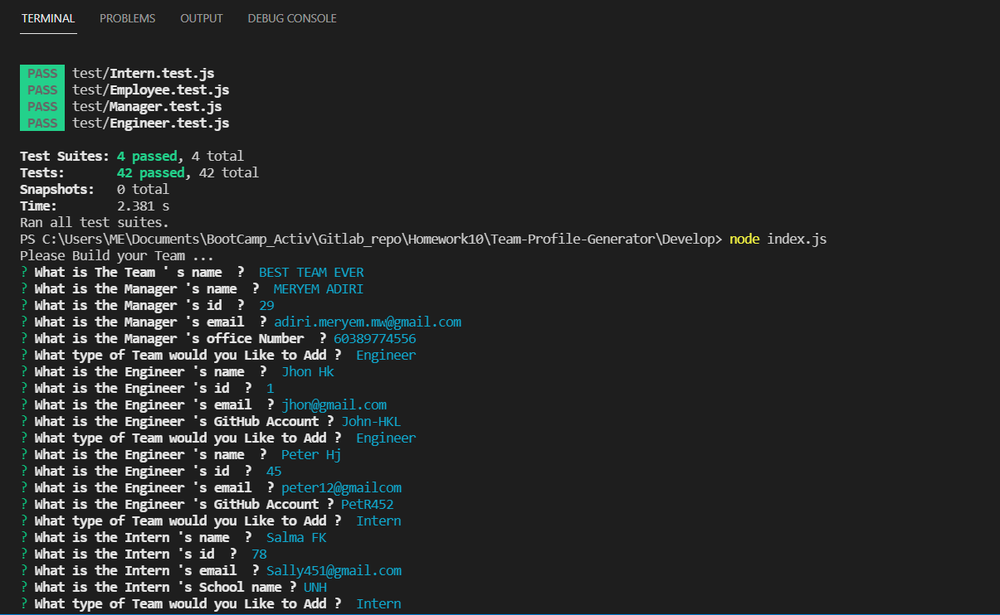
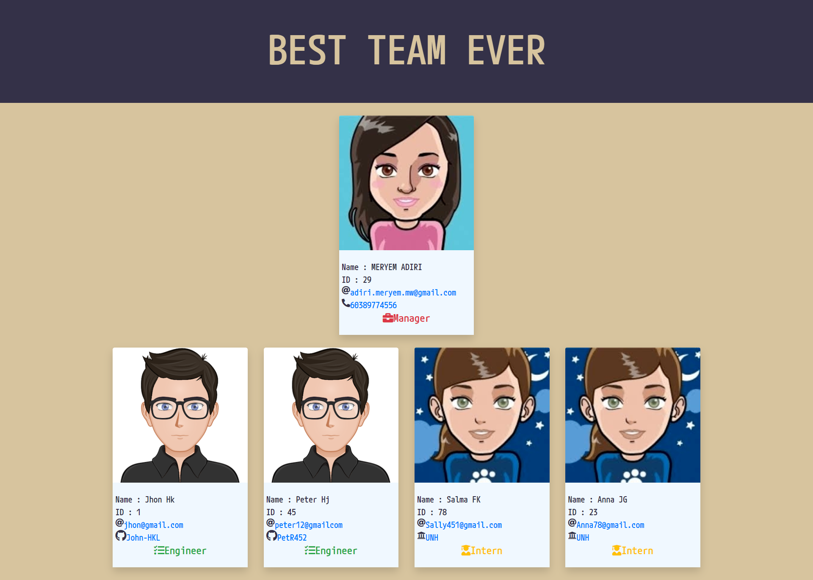

# Project Name :  Team Profile Generator
  
  ## Description:
  This project used to build a **Node.js command-line application** that takes in information about employees on a software engineering team, then generates an HTML webpage that displays summaries for each person.
  ## Table of Contents 
  - [Installation](#installation)
  - [Usage](#usage)
  - [License](#license)
  - [Tests](#tests)
  - [ScreenShot](#screenShot)
  - [Questions](#questions)
  - [Copyright](#copyright)
  ## Installation
  To install dependencies , run this following command :
``` 
 npm i
 ```
  ## Usage
The User need to clone first the repo then install dependencies and run the file index.js

``` 
 node index.js
 ```

  ## License
  this Project is licensed under **ISC** license.
  ## Tests
  to run test , run this following command :
``` 
 npm test
 ```
  ## ScreenShot 
  Terminal :
  
  

  Desktop : 
  
  Mobile : 
  
  ## Questions
  Watch [the walkthrough video](https://drive.google.com/file/d/1J0J7NJO8mdSK-qCM0OSAUowc9-z-_-bM/view) that demonstrates the functionality of the application.

  iF you have any questions about the repo you can contact me by email : adiri.meryem.mw@gmail.com.

  Follow me on [my Github account](https://github.com/MERYEM-AD).
  ## Copyright

   
```
Copyright 2021 , Meryem Adiri.

Permission to use, copy, modify, and/or distribute this software for any purpose with or without fee is hereby granted, provided that the above copyright notice and this permission notice appear in all copies.

THE SOFTWARE IS PROVIDED "AS IS" AND THE AUTHOR DISCLAIMS ALL WARRANTIES WITH REGARD TO THIS SOFTWARE INCLUDING ALL IMPLIED WARRANTIES OF MERCHANTABILITY AND FITNESS. IN NO EVENT SHALL THE AUTHOR BE LIABLE FOR ANY SPECIAL, DIRECT, INDIRECT, OR CONSEQUENTIAL DAMAGES OR ANY DAMAGES WHATSOEVER RESULTING FROM LOSS OF USE, DATA OR PROFITS, WHETHER IN AN ACTION OF CONTRACT, NEGLIGENCE OR OTHER TORTIOUS ACTION, ARISING OUT OF OR IN CONNECTION WITH THE USE OR PERFORMANCE OF THIS SOFTWARE.

```